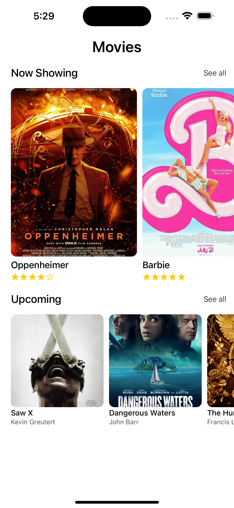
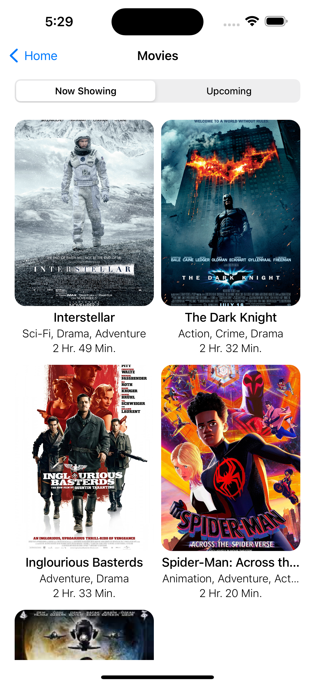
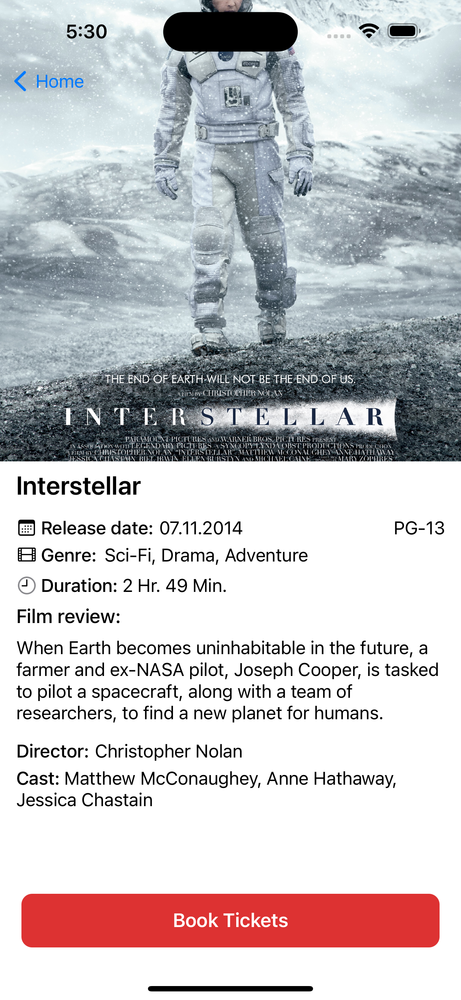
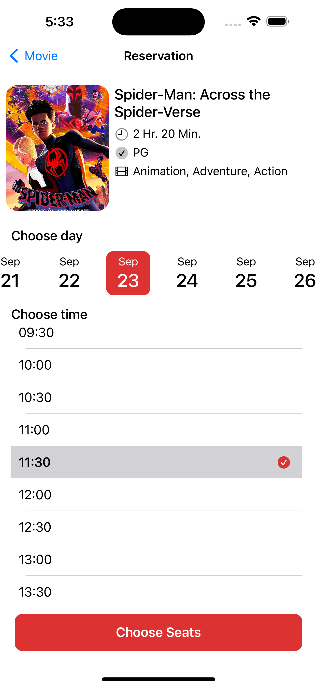
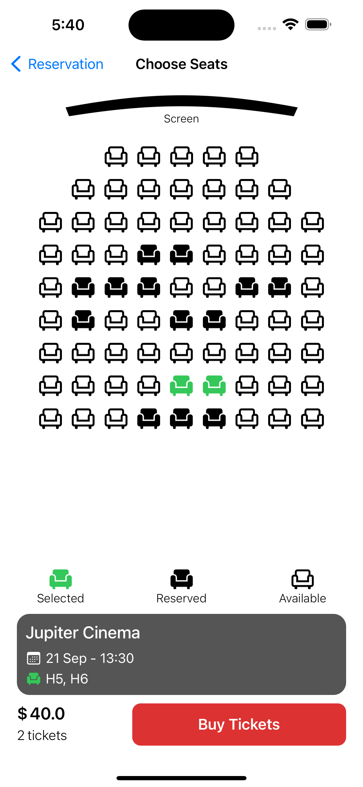
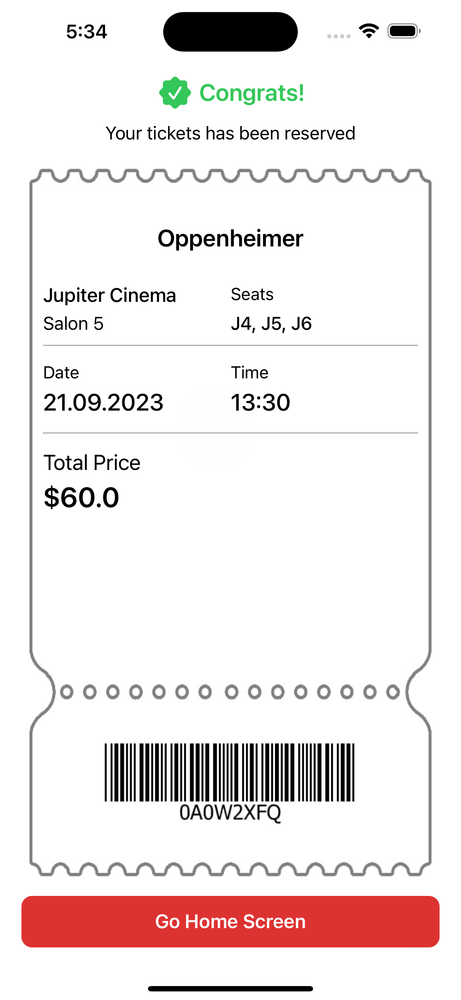
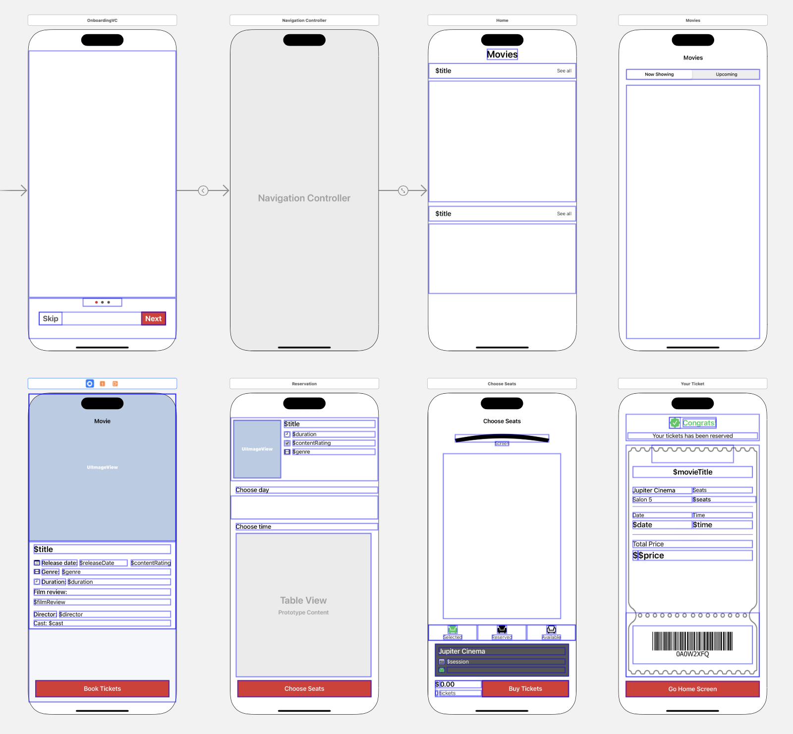

# Movie Ticket Booking Application

This is a movie ticket booking application for iOS devices. It is built using Swift 5.7 and UIKit. The application is built using the MVC architecture. The application uses mock data for now. Development continues.

## Technologies & Tools

- [x] Xcode 14.3.1
- [x] Swift 5.7
- [x] Cocoapods 
- [x] UIKit
- [x] Storyboard
- [x] Auto Layout
- [x] MVC
- [x] Source Control (Git)

## Features

- [x] Movies Slider
- [x] Movie List
- [x] Movie Detail
- [x] Reservation (Choose Date, Time, Seat)
- [x] Movie Ticket

## Screenshots

HOME. | Movies | Movie Details 
:-:|:-:|:-:
 |  |  

Booking | Choose Seats | Movie TICKET
:-:|:-:|:-:
 |  | 

Storyboard |
:-:|

## Video

https://github.com/recepsenoglu/MovieTicketBookingApp/assets/83721234/40239a68-66c0-459d-9a99-8ef8f69c3052

## License

This project is licensed under the MIT License - see the [LICENSE](LICENSE) file for details.
